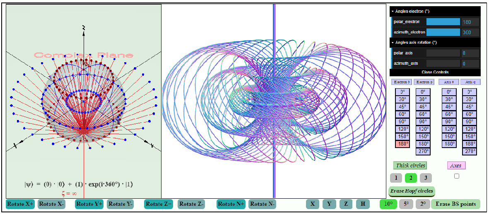
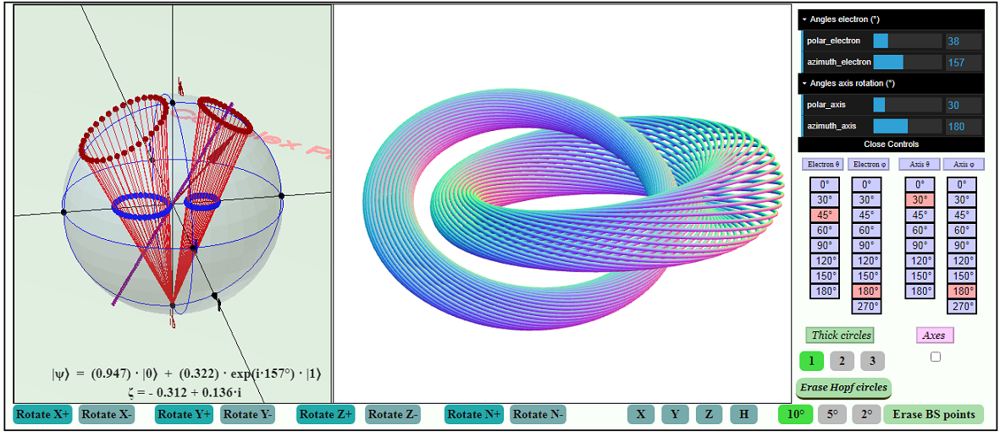

# HopfFibration

<a href ="https://vlad0007.github.io/HopfFibration/" target="_blank">
Hopf fibration</a>

  This site shows a visualization of the Hopf fibration. 
The visualization was performed using quantum rotations on the 
Riemann-Bloch sphere.

A short video that shows how to work with the program is provided on this website
<a href = "https://www.youtube.com/watch?v=hkepdIH3IU8" target="_blank">video</a> 

Screenshot of this program

Screenshot of this program

